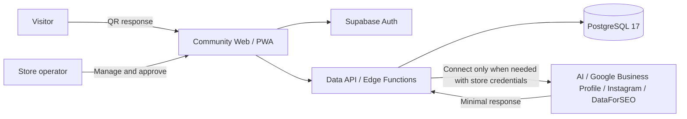

# Architecture

Kuchitoru Zero Community combines a static web application, Supabase Auth/Data API/PostgreSQL, and purpose-specific Edge Functions. It never connects to Hosted billing, trials, credits, an AI gateway, or Kuchitoru-operated usage and cost metering.

## Security boundaries

- The browser receives only public configuration such as the Supabase URL, publishable key, and Turnstile site key.
- Only Edge Functions can read `SUPABASE_SECRET_KEY`, versioned `AI_CREDENTIALS_MASTER_KEY_V{n}` values, the Turnstile secret, and OAuth client secrets. `AI_CREDENTIALS_ACTIVE_KEY_VERSION` selects the version used for new writes.
- Store AI keys and DataForSEO credentials are bound to a store and encrypted with AES-256-GCM.
- Credential read APIs return only `provider`, `model`, `status`, and `keyLast4`; they never return a secret value.
- Both RLS and function-level membership checks enforce store isolation.
- AI destinations, timeouts, input size, and response size are bounded.
- External writes are disabled by default. They run only after an owner/admin enables them for the store and an owner, admin, or editor sends `confirmed: true` for the specific action. Analysts remain read-only. Setting changes and execution results are retained in the audit log.
- Version 1.0.0 includes no automatic posting. `meo-jobs` handles only explicitly enabled rank observations and Google Business Profile insight syncs.

Community supports multiple stores. It has no plan, active-store cap, monthly AI allowance, remaining credits, or Kuchitoru-operated AI usage/cost records. Short-window rate limits and provider-protection limits are operational safeguards, not billing decisions.

## Five Functions

- `owner-api`: stores, surveys, responses, and BYOK connections
- `public-interview`: QR responses through short-lived session tokens and drafting through configured BYOK
- `meo-api`: Google Business Profile, Instagram, and DataForSEO connections, external-write settings, and manual actions
- `meo-jobs`: explicitly enabled rank observations and Google Business Profile insight syncs
- `meo-workspace`: local search work history and approval logs

`owner-api/system-capabilities` returns `edition: community`, `aiMode: byok`, supported providers, and available integrations. A provider is available only when its interview, review, and rewrite model IDs are all configured. Non-AI APIs work when all providers are unset. `owner-api/version` returns the Community version, Git SHA, and database schema version. Neither endpoint returns secrets or deployment-specific settings.

Without an AI key, only AI generation is unavailable. QR answers remain stored for manual editing or retry after a key is configured.

## Distribution

The Docker installation runs the official Supabase self-hosted bundle as a separate component and adds the web app, baseline migration, and five Functions through a thin Compose override. Its `main` entry is an in-container dispatcher for those five Functions and is not deployed to Supabase Cloud. Cloud deploys the same migration and five Functions through the CLI. Both use the same browser application and API contract. The optional fictional seed runs only by explicit command, never as part of normal startup or migration.
