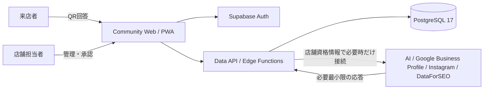

# 構成

クチトルZero Communityは、静的Webアプリ、SupabaseのAuth／Data API／PostgreSQL、用途別Edge Functionsで構成します。Hosted版の課金、試用枠、クレジット、AI中継、利用量・原価計測には接続しません。

## セキュリティ境界

- ブラウザへ渡すのはSupabase URL、publishable key、Turnstile site keyなどの公開設定だけです。
- `SUPABASE_SECRET_KEY`、version付きの `AI_CREDENTIALS_MASTER_KEY_V{n}`、Turnstile secret、OAuth client secretはEdge Functionsだけが参照します。書き込みに使うkey versionは `AI_CREDENTIALS_ACTIVE_KEY_VERSION` で指定します。
- 店舗のAIキーとDataForSEO認証情報は店舗IDに結び付け、AES-256-GCMで暗号化します。
- 資格情報の取得APIは `provider`、`model`、`status`、`keyLast4` だけを返し、秘密値は返しません。
- RLSとFunctionの店舗所属確認を両方通し、店舗間の参照を防ぎます。
- AI送信先、タイムアウト、入力・応答サイズを制限します。
- 外部書き込みは初期状態で無効です。owner／adminが店舗設定で有効にし、書き込み可能なowner／admin／editorが対象操作へ `confirmed: true` を付けた場合だけ実行します。analystは閲覧専用です。設定変更と実行結果は監査ログへ残します。
- v1.0.0に自動投稿は含みません。`meo-jobs` は明示的に有効化した順位観測とGoogle Business Profileインサイト同期だけを扱います。

Communityは複数店舗を扱えます。plan、active-store上限、月次AI枠、残クレジット、クチトル側のAI利用量・原価記録は持ちません。短時間のrate limitとprovider保護用の運用上限は、課金判定ではなく安全策として扱います。

## 5 Functions

- `owner-api`: 店舗、アンケート、回答、BYOK接続を管理
- `public-interview`: 短命session tokenでQR回答を受け付け、設定済みBYOKで文案を生成
- `meo-api`: Google Business Profile、Instagram、DataForSEOの接続、外部書き込み設定、手動実行
- `meo-jobs`: 明示的に有効化した順位観測とGoogle Business Profileインサイト同期
- `meo-workspace`: MEO作業履歴と承認ログ

`owner-api/system-capabilities` は `edition: community`、`aiMode: byok`、対応providerと利用可能な外部接続を返します。providerはinterview、review、rewriteの3モデルIDがそろった場合だけ利用可能になります。全providerが未設定でも非AI APIは動作します。`owner-api/version` はCommunity version、Git SHA、DB schema versionを返します。どちらも秘密値や導入者固有の設定値を返しません。

AIキーがない場合はAI生成だけが利用不可です。QR回答は保存され、手動編集またはキー設定後の再生成ができます。

## 配布

Docker版はSupabase公式self-hosted bundleを独立コンポーネントとして使い、薄いCompose overrideでWeb、baseline Migration、5 Functionsを追加します。自己ホスト版の `main` は、この5 Functionsへ振り分けるコンテナ内dispatcherです。Supabase Cloudへ `main` は配備しません。Cloud版は同じMigrationと5 FunctionsをCLIで配備します。どちらも同じブラウザアプリとAPI契約を使います。任意の架空seedは明示コマンドでだけ実行し、通常起動やMigrationには組み込みません。
